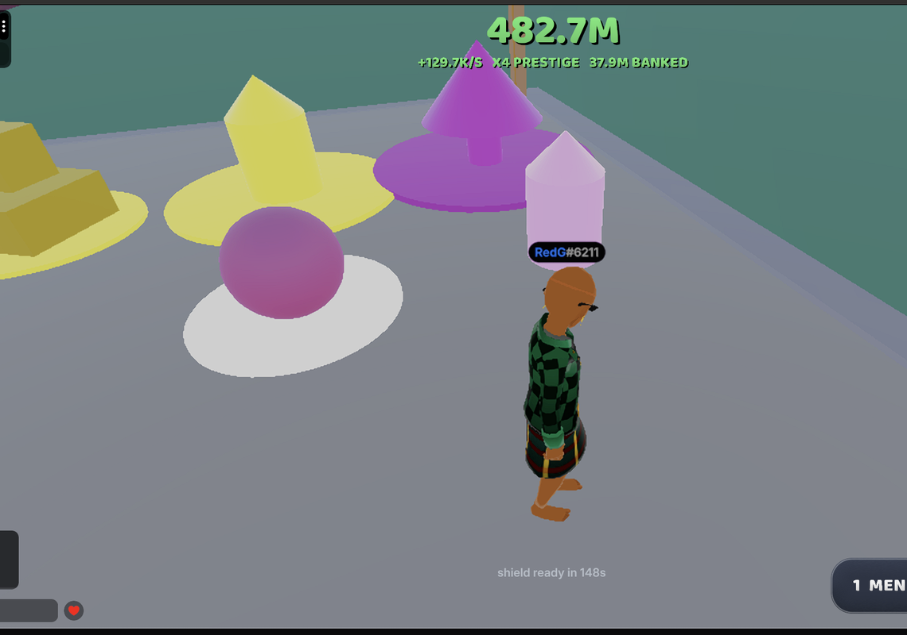

# Rob a Base



**How rich can you get before someone robs you?** Smash crates, put your loot on show, and
it earns while you are away. Lock your door, arm a sentry, or go rob theirs.

A multiplayer tycoon-theft game for the Decentraland mobile app, built for the Friendzone
Mobile Buildathon 2026. World: `basewar.dcl.eth`.

| Play it | Link |
|---|---|
| Phone (Decentraland mobile app) | https://mobile.dclexplorer.com/open?realm=basewar.dcl.eth |
| Desktop (Decentraland launcher) | https://decentraland.org/jump?realm=basewar.dcl.eth |
| Public listing | https://decentraland.org/places/world/?name=basewar.dcl.eth |

## The loop

1. **Buy a crate** on the belt in the middle of the plaza. It walks to your base, and anyone
   can outbid you for it at 150 % on the way.
2. **Smash it** on your base to reveal an item: 7 rarities, 14 mutations, themed crates during
   rushes.
3. **Put it on show.** Everything on display earns coins, online and offline (35 % of your
   income for up to four hours while you are away, collected on your next visit).
4. **Rob a base.** Walk into someone else's, hold the action button, carry the item home.
   The owner is alerted the moment you touch it and can shoot you down on the way out.
5. **Defend yours.** A lock seals the door for a while (150 s recharge, only after use), a
   sentry per storey blocks thieves and fires a tracer everyone sees and hears, and gear
   (traps, cloak, taser, bomb) turns a visit into a fight.
6. **Grow.** Up to 12 storeys of 6 slots, fusion of items into rarer ones, luck upgrades,
   base skins, prestige (rebirth), quests, a seven-day daily reward, and a global leaderboard.
7. **Show up for the rush.** A random rush on a timer, a grand rush at a fixed UTC hour every
   day, a boss on the plaza, and raids on other players' bases.

Everything above is live in the world and served by one authoritative server: all state, loot
rolls, prices, distances and anti-cheat checks run headless, clients only send intent.

## For judges

The three explanations the Buildathon asks for, as answers.

**Designed for mobile.** The scene hides the native touch pad and lays out its own: one
contextual action button whose glyph changes with what is in front of you (buy, smash, rob,
lock, place, fuse), a jump disc that swaps to the client's own glider glyph after the second
press in the air (the two pictures are the mobile explorer's own, see `NOTICE.md`), and a
draw button for the pistol. Every HUD element sits inside the device safe area; held actions
are buffered until the room is synced, so a tap never silently drops. There are no particles
and no light sources (the mobile renderer has neither); every effect is geometry or a
textured quad, and the whole world stays inside a measured object budget of 385 for the
Godot client. Every tinted text is checked against a 4.5:1 contrast floor at build time.
The desktop HUD is the same pad, scaled up, so the two platforms play identically.

**Encourages social interaction.** Nothing you own is safe: every item on show can be
carried away by another player, the owner gets a live alert with the thief's name, and the
chase is a shootout. Convoys can be outbid by anyone watching the belt. You can leave a gift
on a friend's base as well as rob it. Sentry shots, door seals and rush announcements are
broadcast to everyone in the world, so a busy plaza is visibly busy. Base signs carry the
owner's name and prestige, the leaderboard ranks the whole world.

**Why players come back.** Offline income makes leaving a decision, not an exit: your base
keeps earning for four hours and the welcome-back screen pays it out. A daily reward on a
seven-day cycle, quests, the grand rush at the same UTC hour every day, prestige tiers that
reset the base for a permanent multiplier, twelve storeys to unlock, and a collection index
of every rarity and mutation give a reason to return each day. And someone may have robbed
you while you were gone.

### Verify in sixty seconds

- Open the phone link above; the world loads without any account setup beyond the app's own.
- The four-character build stamp in `1 MENU` is the deployed commit; compare it with `git log`.
- `images/base-war-thumbnail.png` in this repository is byte-identical to the thumbnail the
  Worlds content server serves for `basewar.dcl.eth`.
- Server logs of the live world: `npm run server-logs -- --world basewar.dcl.eth` (wallet
  listed in `scene.json` `logsPermissions`).

## Architecture

Decentraland SDK7 with the **multiplayer server** branch (`@dcl/sdk@auth-server`): one
codebase, `isServer()` branching, the server runs headless on Decentraland's infrastructure
and persists to Decentraland `Storage`. No private backend, no external service.

- 94 message types between client and server, 31 server-side handlers, 13 validators on
  synced components so a client can never write server-owned state.
- Clients never send a price, a roll or a position that matters: the server measures
  distances itself from `PlayerIdentityData`.
- Coins and prices are `Int64`; working state lives in memory and is persisted at
  checkpoints, because storage writes are capped and the isolate has a 256 MB ceiling.
- About 19,700 lines of TypeScript; CI builds every push (`.github/workflows/ci.yml`).

```
src/
  index.ts        entry point, server/client branching
  shared/         synced components, messages, economy, loot table, quests (both sides)
  server/         belt, convoys, loot, theft, combat, gear, fusion, raids, events, records
  client/         rendering, input pad, HUD, plots, combat feel, toys, preload
tools/            generators for every model, sound, texture, icon and emote in assets/
```

`src/shared/economy.ts` holds every economic constant in one place, with the reasoning next
to each number. `tools/economy/sim.js` replays the whole progression.

## Assets are generated

Apart from the pistol (`assets/Models/gun.glb`, from the open Decentraland model catalog) and
the two joypad glyphs credited in `NOTICE.md`, every model, sound, texture, icon and avatar clip in
`assets/` is built by a script in `tools/`: crates, storeys, the padlock, the vegetation, the
plaza ring, the gun sounds, the coin ticks, the muzzle flash, the nine-sliced HUD plates, the
key art card. Decentraland ships three fonts and no more, so rounded corners, borders and
gradients come from signed-distance-field images rather than a typeface. A scene cannot pose
the avatar skeleton except through emotes, so the aim and shot clips are solved by inverse
kinematics against the reference rig.

## Run it locally

```bash
npm install
npm run start
```

Two players locally, two identities, one server:

```bash
npm run duo
```

It kills any stale preview, starts one on port 8000 and opens two explorer windows against
it. `npm run duo:reset` does the same after clearing scene storage. `bash tools/deploy.sh`
builds for production, writes the build stamp and deploys to the world.

## License

MIT, see [LICENSE](LICENSE). Third-party attributions are listed in [NOTICE.md](NOTICE.md).
